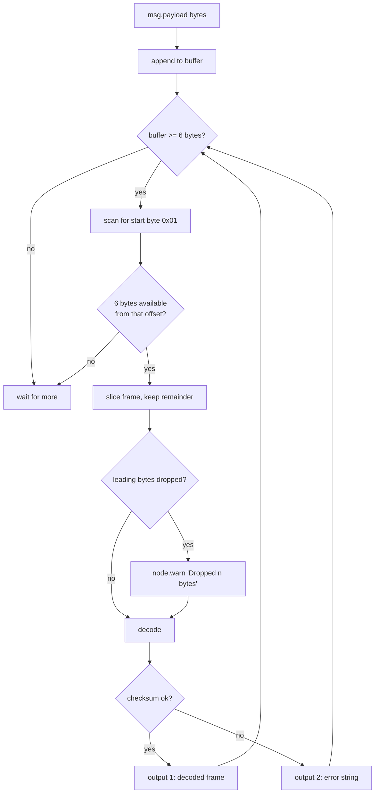
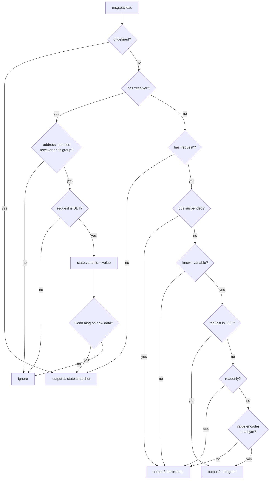

# Behavioural design

## Receiving: `valloxrx`

The serial port delivers arbitrary chunks, not frames. `valloxrx` therefore keeps a buffer across
messages and drains it on every input:

Three behaviours here are load-bearing and easy to regress:

- **The loop continues until the buffer is drained.** Several frames can arrive in one chunk.
- **Each frame gets a fresh `msg` object** (`Object.assign({}, msg, { payload })`). Reusing the
  input `msg` made back-to-back frames alias one payload, so earlier frames were overwritten before
  the flow saw them.
- **Resynchronisation is silent-but-warned.** Bytes before a start byte are discarded and counted in
  a warning, rather than throwing away the whole buffer or blocking on a partial frame.

Note that `0x01` is only a _probable_ frame start: it is also a legal value for other bytes. A
mis-framed slice is caught by the checksum and reported on output 2.

## Sending: `valloxtx`

Stateless. It takes `{ domain, sender, receiver, command, arg }`, appends the checksum and emits a
six-element array on output 1, or an error string on output 2. An empty payload is the only input
error it recognises — a malformed telegram object produces a malformed frame rather than an error.

## Holding state: `vallox`

One node instance represents one bus address, configured as **Receiver**. It branches on the shape
of `msg.payload`:

### Address matching

A frame updates the cache when either holds:

- **it comes from a mainboard** — `sender & 0xf0 === 0x10`, so `10H`-`1FH` — whatever the recipient
  is, or
- **it is addressed here**: `message.receiver` equals the configured address or its group, the group
  being the high nibble (`receiver & 0xf0`), so a node at `0x21` also takes broadcasts to `0x20`.

The first rule is what makes a single node see the whole system. The master answers every panel's
poll individually, and the value it reports is the same value whoever asked for it — so the node
learns everything the physical panels poll for without adding traffic of its own. A captured minute
held 130 requests and their replies; matching only on the recipient discarded nearly all of them.

Frames between two other modules — panel 3 writing to panel 2 — are ignored, as are `GET` requests,
which carry no value.

### Why the readonly branch returns

A `SET` to a read-only variable emits on output 3 **and stops**. An earlier version fell through and
also emitted the telegram on output 2, so a rejected write still reached the bus. The error path
returning early is the whole point of that branch — see
[ADR 0002](adr/0002-reject-readonly-writes-before-emitting.md).

### Outgoing addressing

Telegrams carry `sender = <configured receiver>`: the node impersonates the panel it is configured
as, so that address must not belong to a physical panel as well.

A **read** is one telegram to the master. A **write** is three, which is what a real control unit
sends — confirmed against a capture of an original panel stepping the fan speed, where all fourteen
changes used the same sequence:

| #   | Receiver              | Bytes              | Purpose                           |
| --- | --------------------- | ------------------ | --------------------------------- |
| 1   | `0x11` mainboard 1    | 7 (checksum twice) | the write itself                  |
| 2   | `0x20` all panels     | 6                  | peer panels update their displays |
| 3   | `0x10` all mainboards | 6                  | slave mainboards follow           |

The master also re-broadcasts the change on its own, so the first telegram alone usually suffices;
_Write like a panel_ can be unticked to send only that one. Each telegram gets its own `msg` — they
shared one object at first, and only the last survived.

### Reading a register

A `GET` builds the request form of the telegram: `command = 0x00` and the register being asked for
in `arg`, per the request/response principle in the protocol document. The read-only check is
skipped, because reading a read-only variable is the point. The reply is an ordinary `SET`-shaped
frame from the master and arrives through `valloxrx` like any other traffic — nothing correlates
the reply with the request, so a `GET` is fire-and-forget and the value simply turns up in the
cache.

This matters more than it looks: the master broadcasts only seven registers (`2AH`, `2BH`, `2CH`
and `32H`-`35H`) every 12 seconds. Every other variable is only observable by polling for it.

### Bus suspension

`91H` prohibits modules from transmitting and `8FH` allows it again; the unit issues them around
CO2 sensor interaction. Because they are broadcast to every module, the node honours them whoever
they are addressed to, and refuses to emit telegrams while suspended — reporting each refusal on
output 3 rather than dropping it silently. A missed `8FH` would otherwise wedge the node, so the
block also lapses after 10 seconds.

## Error handling

Errors travel as **strings on a dedicated output**, not as thrown exceptions and not via
`node.error`. Each node also calls `node.warn`, so problems appear in the debug sidebar even when
the error output is unwired.

| Node       | Error output | Cases                                                                                    |
| ---------- | ------------ | ---------------------------------------------------------------------------------------- |
| `valloxrx` | 2            | Bad checksum, wrong length, empty buffer                                                 |
| `valloxtx` | 2            | Empty payload                                                                            |
| `vallox`   | 3            | `SET` on a read-only variable, unknown variable, value that is not a byte, bus suspended |

The consequence is that a flow never crashes on bad bus data; it accumulates errors on a branch you
may choose to ignore. When debugging silence, wire the error outputs first.

## Status indicators

`valloxrx` and `valloxtx` set a green ring on success and a red ring carrying the error text on
failure. Both clear their status on close. The `vallox` node sets no status.
