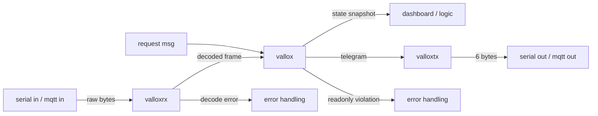

# Overview

`node-red-contrib-vallox` exposes a Vallox ventilation unit's RS485 bus to Node-RED. It contributes
three nodes that sit between a byte-stream node (serial or MQTT) and the rest of a flow.

## What it is not

The package does not talk to hardware. It has **no runtime dependencies** and opens no ports: it is
pure frame encoding, decoding and state-keeping. Getting bytes on and off the wire is the job of
whatever node you put in front of it — normally `node-red-node-serialport` against an RS485
adapter, or an MQTT bridge to a serial gateway elsewhere on the network.

That separation is deliberate. It keeps the protocol logic testable without hardware, and lets the
same nodes work over serial, MQTT, TCP or a replay of captured traffic.

## The bus

Vallox devices speak a fixed 6-byte frame:

| Byte    | 0      | 1      | 2        | 3       | 4        | 5        |
| ------- | ------ | ------ | -------- | ------- | -------- | -------- |
| Meaning | domain | sender | receiver | command | argument | checksum |

- **domain** is always `0x01`.
- **sender** / **receiver** are bus addresses: master 1 is `0x11`, panels 1-7 are `0x21`-`0x27`,
  LON is `0x28`. The high nibble addresses a whole group, so a frame sent to `0x20` reaches every
  panel.
- **command** is the variable byte (see the command reference in the README), or `0x00` for a read
  request — in which case the argument holds the variable being asked for.
- **checksum** is the sum of the first five bytes modulo 256.

Devices broadcast continuously, so nothing has to poll to observe the system. That property shapes
the whole design: the `vallox` node is a passive cache fed by traffic it never asked for.

## Runtime model

Each node has one responsibility and holds only the state that responsibility requires:

| Node       | State                   | Responsibility                                     |
| ---------- | ----------------------- | -------------------------------------------------- |
| `valloxrx` | byte buffer             | Frame the stream, decode, report errors            |
| `vallox`   | last value per variable | Cache the device picture, build outgoing telegrams |
| `valloxtx` | none                    | Serialise one telegram to bytes                    |

## Protocol source

Behaviour is defined by the Vallox RS485 protocol document, of which two translations are kept:

- [`doc/vallox-rs485-protocol.md`](../vallox-rs485-protocol.md) — the **authority for read/write
  classification**. It carries the per-register and per-bit `read only` / `write only` markers.
- [`doc/protocol.txt`](../protocol.txt) — a pdftotext extract of the other translation. It lost
  several of those markers (four were corrected against the first file), but it alone has **Annex
  B**: the 12-second broadcast list, worked sample frames, and the Helios three-recipient write
  sequence.

Annex A, the NTC conversion table, is identical in both. When adding or correcting a variable those
documents are the authority — not this code, not the `valloxserial` Arduino library it was ported
from, and not the flows people have built on top of it.

That authority is enforced, not just asserted: [`test/protocol-doc.test.js`](../../test/protocol-doc.test.js)
parses the document at test time and checks the implementation against it — all 256 Annex A
temperature entries, the fan-speed bit ramp, the fault codes, and that every documented command byte
is implemented. Two bytes the code decodes are absent from the document (`0x6C` and `0x6E`); the
test pins that list so a third cannot appear unnoticed.

## Further reading

- [Structural design](structural-design.md) — modules and their boundaries.
- [Behavioural design](behavioural-design.md) — what happens to a message at runtime.
- [ADR log](adr/README.md) — decisions and why they were made.
