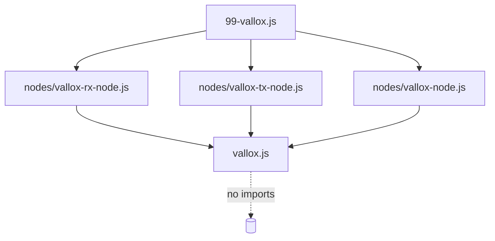

# Structural design

## Layout

```text
vallox/
  99-vallox.js          the file package.json registers; a thin delegator
  99-vallox.html        editor UI, palette entries and help for all three nodes
  vallox.js             the protocol: framework-independent, no Node-RED imports
  nodes/
    vallox-rx-node.js   byte-stream decoder
    vallox-tx-node.js   telegram encoder
    vallox-node.js      device shadow for one bus address
  icons/                palette icons, resolved by Node-RED relative to the node dir
```

The shared standard in `AGENTS.md` calls for framework-independent logic in `lib/`. Here that layer
is the single file `vallox/vallox.js`. It is kept where it is because Node-RED resolves a node's
icons relative to the directory holding the registered `.js` file, and because one protocol module
does not need a directory of its own. If a second framework-independent module ever appears, that
is the moment to introduce `lib/`.

## The entry file

`package.json` registers exactly one node file:

```json
"node-red": { "nodes": { "vallox": "vallox/99-vallox.js" } }
```

`99-vallox.js` contains no logic. It requires the three modules under `nodes/` and calls each with
`RED`. Node-RED pairs it with `99-vallox.html` by basename, and that single HTML file carries the
editor definitions for all three node types.

The consequence worth knowing: **the three nodes are registered together or not at all**, and any
new node type means another `require` line in the delegator plus another block of HTML — not a new
entry in `package.json`.

## The protocol module

`vallox/vallox.js` is intentionally flat. It exports only five things:

| Export                               | Purpose                                                            |
| ------------------------------------ | ------------------------------------------------------------------ |
| `decode(buffer, onMessage, onError)` | Verify checksum and length, produce a message object               |
| `encode(message, onBuffer, onError)` | Serialise a telegram, appending the checksum                       |
| `convert(variable, value)`           | Resolve a human name and value to `{ command, arg, readonly }`     |
| `constants`                          | Frame length, domain, master address, `GET`/`SET` strings (frozen) |
| `variables`                          | Every documented command byte (frozen)                             |

Everything else is module-private. Internally it is organised as:

- **`Variables`** — one entry per command byte. The comment blocks above the flag variables document
  their bit layout and are the reference used when writing a decoder; keep them in step with the
  code.
- **`VALLOX_COMMAND_VARIABLE_MAPPING`** — the single source of truth tying a command byte to a
  human name and a `readonly` flag. `getVariableName`, `getCommand` and `isReadonly` all read from
  it. It is keyed by byte value, so iterate it with `for...of` over `Object.keys`, never `for...in`
  (see [ADR 0003](adr/0003-command-mapping-is-the-single-source-of-truth.md)).
- **`VALLOX_TEMPERATURE_MAPPING`** — the 256-entry NTC table from Annex A. Decoding is an index
  lookup; encoding is a closest-match scan, because the table is lossy and not every °C value has
  an exact byte.
- **per-variable converters** — `convertFanSpeed`, `convertFlagsN`, `convertSelect`, … and their
  `*Back` inverses, dispatched from the `convertValue` / `convertValueBack` switches.

### Adding a variable

1. Add the byte to `Variables`, with a comment block if it carries bit flags.
2. Add a mapping entry with the correct `readonly` flag, taken from the protocol document.
3. Add a `case` to `convertValue` if the raw byte needs interpreting.
4. Add a `case` to `convertValueBack` **if the variable is writable** and needs real maths. Without
   it a value is placed in the telegram unchanged, which silently produces a malformed frame for
   anything that is not already a byte. Bit fields need an inverse built from `composeBits` so a
   decoded object can be written straight back.
5. Add the variable to the README tables and extend the tests.

## Dependency direction



Nothing flows the other way. `vallox.js` never imports `RED`, never touches a node, and can be
exercised from a plain script — which is what the protocol tests do, with no Node-RED runtime in
sight.

## Tests

| File                          | Scope                                                            |
| ----------------------------- | ---------------------------------------------------------------- |
| `test/vallox.test.js`         | Pure protocol: decode, encode, round-trips, NTC table, flag bits |
| `test/vallox-rx-node.test.js` | RX node in a real Node-RED runtime                               |
| `test/vallox-tx-node.test.js` | TX node in a real Node-RED runtime                               |
| `test/vallox-node.test.js`    | State, requests, readonly handling                               |
| `test/readme-tables.test.js`  | The README reference tables still match the code                 |
| `test/examples.test.js`       | Every shipped example flow is sound and its requests are valid   |
| `test/protocol-doc.test.js`   | The implementation still agrees with both protocol translations  |

The node tests boot Node-RED in-process through `node-red-node-test-helper`; the protocol tests do
not, and run in milliseconds.
